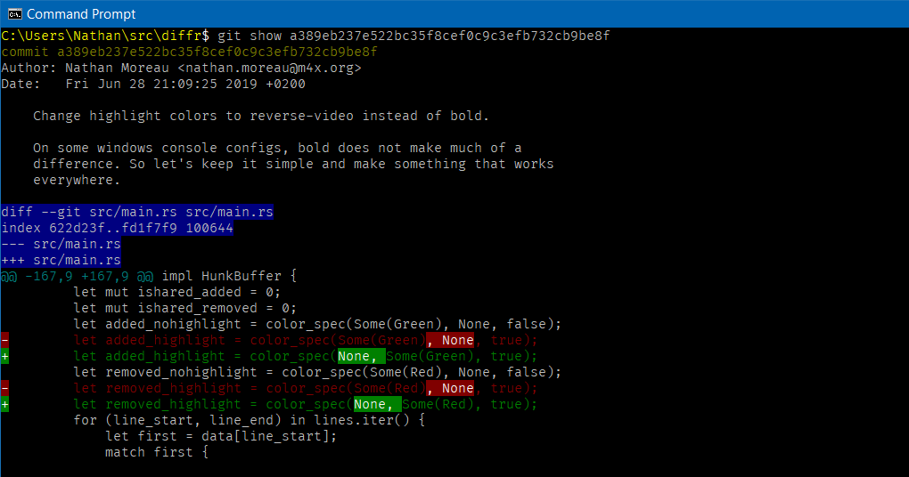

## diffr

### Overview

Reviewing changes involves reading diffs.  Sometimes, a line-oriented
presentation of changes is not precise enough, especially when changes
involve long lines or very similar consecutive lines.

This program processes such diffs, and output them (in the console)
with additional diff information on top of the unified diff format,
using text attributes.

It works hunk by hunk, recomputing the diff on a word-by-word basis.

The current implementation uses 
[Myers longest common subsequence](http://www.xmailserver.org/diff2.pdf) 
algorithm.

[](https://img.shields.io/crates/v/diffr.svg)
[](https://dev.azure.com/nathanmoreau/diffr/_build/latest?definitionId=4&branchName=master)

### Screenshots




### Installation

#### Arch Linux

Install from the [AUR](https://aur.archlinux.org/packages/diffr/):

```
git clone https://aur.archlinux.org/diffr.git
cd diffr
makepkg -si
```

#### From Source

You will need the [Rust compiler installed](https://www.rust-lang.org/tools/install).

```
git clone https://github.com/mookid/diffr.git
cd diffr
cargo install --path .
```

### How to use it?

diffr tries to be a well behaved unix program: it reads its input from stdin
and writes to stdout.

#### To test it:
```
cargo build --release
git show HEAD | path/to/diffr
```

#### To integrate it with git:

Add the following section to your `.gitconfig` file:

```
[pager]
    log  = path/to/diffr | less -R
    show = path/to/diffr | less -R
    diff = path/to/diffr | less -R
```

### Related projects

This is improvement on the
[diff-highlight](https://github.com/git/git/tree/master/contrib/diff-highlight)
script distributed with git.

git itself provides both `--word-diff` and `--color-words` options to
several commands.
