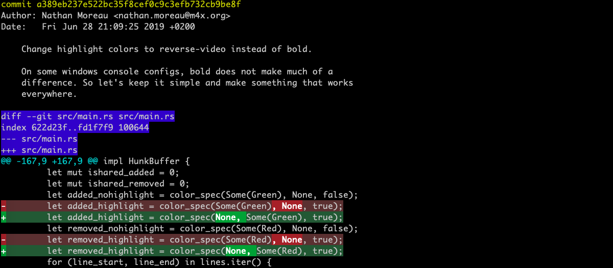
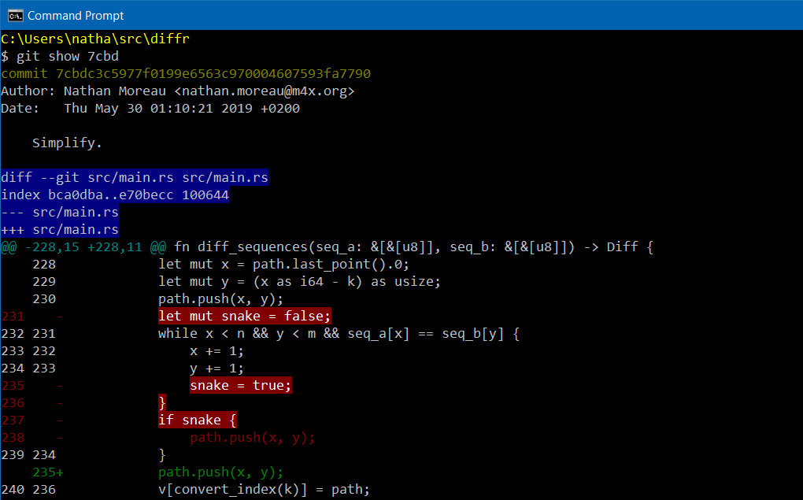
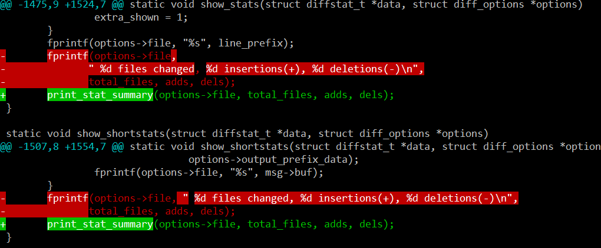

## diffr

Reviewing changes involves reading diffs.  Sometimes, a line-oriented
presentation of changes is not precise enough, especially when changes
involve long lines or very similar consecutive lines.

This program processes such diffs, and outputs them (in the console)
with additional diff information on top of the unified diff format,
using text attributes.

It works hunk by hunk, recomputing the diff on a word-by-word basis.

The current implementation uses 
[Myers' longest common subsequence](http://www.xmailserver.org/diff2.pdf) 
algorithm.

[](https://crates.io/crates/diffr)
[](https://crates.io/crates/diffr)
[](https://dev.azure.com/nathanmoreau/diffr/_build/latest?definitionId=4&branchName=master)





### Installation

#### Arch Linux

Install from the [AUR](https://aur.archlinux.org/packages/diffr/):

```
git clone https://aur.archlinux.org/diffr.git
cd diffr
makepkg -si
```

#### Homebrew

```
brew install diffr
```

#### From source

You will need the [Rust compiler installed](https://www.rust-lang.org/tools/install).

To install the latest published version:

```
cargo install diffr
```

Alternatively, you can build the development version:

```
git clone https://github.com/mookid/diffr.git
cd diffr
cargo install --path .
```

### How to use it?

diffr tries to be a well behaved Unix program: it reads its input from stdin
and writes to stdout.

#### One-off usage

```
git show HEAD | diffr
```

#### Integration with git

Add the following section to your `.gitconfig` file:

```
[core]
    pager = diffr | less -R
[interactive]
    diffFilter = diffr
```

Alternatively, you can run from the command line:

```
git config --global core.pager 'diffr | less -R'
git config --global interactive.difffilter diffr
```

#### Color customization

Use the --colors flag.

You can customize the display of diffing and common segments of added
and removed lines.

For example,

```
diffr --colors refine-removed:background:200,0,0:foreground:white:bold
```

tweaks the red used for uniquely removed text;

The configuration used in the first screenshot is

```
diffr --colors refine-added:none:background:0x33,0x99,0x33:bold --colors added:none:background:0x33,0x55,0x33 --colors refine-removed:none:background:0x99,0x33,0x33:bold --colors removed:none:background:0x55,0x33,0x33
```

#### Display line numbers

The ` --line-numbers` displays the line numbers of the hunk.

### Related projects

This is improvement on the
[diff-highlight](https://github.com/git/git/tree/master/contrib/diff-highlight)
script distributed with git.

git itself provides both `--word-diff` and `--color-words` options to
several commands.
